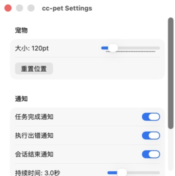

# cc-pet

cc-pet 是一款 macOS 桌面萌宠。它通过 Claude Code Hooks 感知会话状态，
并用原创黄色小猪动画、桌面气泡和系统通知反馈当前进度。


## 应用截图

cc-pet 以悬浮小猪显示当前会话状态，并提供大小、通知和 Claude Code Hook
设置。

<p align="center">
  
  &nbsp;&nbsp;&nbsp;
  
</p>

## 功能

cc-pet 在本机运行，不会把 Hook 事件发送到网络。它提供以下功能：

- 用 7 组 Lottie 动画表示休眠、空闲、思考、执行、完成、出错和等待确认。
- 同时管理多个 Claude Code 会话。
- 在任务完成、出错或会话结束时发送系统通知。
- 用桌面气泡展示关键事件。
- 保存宠物的窗口位置和显示尺寸。
- 将 Hook 配置一键写入 `~/.claude/settings.json`。

## 系统要求

从源码运行需要以下环境：

- macOS 13 Ventura 或更高版本。
- Swift 5.9 或更高版本。
- Node.js，用于执行 Claude Code Hook 脚本。
- 可选：Python 3 和 Pillow，用于重新生成应用图标。

## 从源码运行

将仓库克隆或下载到本机后，进入项目目录并运行：

```bash
swift run
```

运行测试和完整检查：

```bash
bash Scripts/verify.sh
```

构建可分发的 DMG：

```bash
bash Scripts/build-dmg.sh
```

生成结果位于 `dist/cc-pet.dmg`。

## 安装 Hook

启动 cc-pet 后，打开 **设置**，再点击 **安装 Hook**。应用会把 Hook 脚本
复制到 `~/.cc-pet/hook.js`，并更新 `~/.claude/settings.json`。

Hook 通过 `~/.cc-pet/pet.sock` 向 cc-pet 发送本机会话事件。事件只在本机
Unix Domain Socket 中传递。

## 动画状态

每种 Claude Code 事件会映射为一种宠物状态：

| 状态 | 触发事件 | 视觉表现 |
|---|---|---|
| 休眠 | `SessionEnd` 或默认状态 | 闭眼缓慢呼吸 |
| 空闲 | `SessionStart`、`PostToolUse` | 一开一眨眼并轻轻弹跳 |
| 思考中 | `UserPromptSubmit` | 倾斜头部并冒出思考气泡 |
| 执行中 | `PreToolUse` | 挥动锤子并随敲击震动 |
| 完成 | `Stop` | 跳起并散开星星和彩纸 |
| 出错 | `PostToolUseFailure` | 显示 X 眼并落下汗滴 |
| 等待确认 | 预留状态 | 瞪大眼睛并闪烁感叹号 |

## 项目结构

主要目录如下：

```text
CCPet/          Swift、SwiftUI 和 AppKit 源码
CCPetTests/     Swift Testing 测试
Scripts/           Hook、资源生成、检查和打包脚本
Resources/         应用图标
```

`Scripts/generate_lottie.py` 通过矢量图层生成全部 `pet_*.json` 动画。
修改动画后，必须同步更新 `CCPet/UI/AboutView.swift` 中对应的状态说明，
再运行 `bash Scripts/verify.sh`。

## 隐私

cc-pet 会读取 Claude Code Hook 提供的事件类型、会话 ID、工作目录和工具名称，
用于显示当前会话状态。当前实现不包含遥测、分析服务或远程 API 请求。

## 许可证

本项目使用 [MIT License](LICENSE)。第三方依赖保留各自的许可证。
